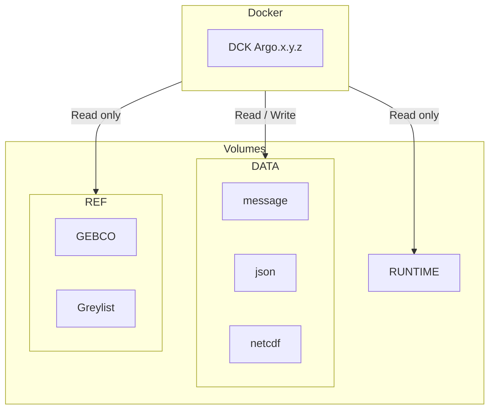

# Projet de Dokerisation des décodeurs Argo

## Schéma d'architecture



**Flux** :

<https://data-argo.ifremer.fr/ar_greylist.txt>

**Volumes** :

- `/mnt/runtime`
- `/mnt/data/output`
- `/mnt/data/rsync`

## Intégration continue avec GitLab CI

Documentation des tâches GitLab CI : <https://dev-ops.gitlab-pages.ifremer.fr/hebergement_web/templates/remote-ci-templates/#taches>

## Générer une nouvelle version du décodeur Dockerisé

Créer un [TAG](https://gitlab.ifremer.fr/coriolis/developpement/argo/decodage/decode_argo/-/tags) git correspondant au numero de version du décodeur que vous souahitez dockerisée génèrera automatiquement une image docker comprenant ce décodeur, elle sera déposée dans le [conteneur registry du projet](https://gitlab.ifremer.fr/coriolis/developpement/argo/decodage/decode_argo/container_registry/1008)

## Exécution le décodeur Dockerisé

- Configuration commande pour l'Ifremer :

```bash
APP_USER="202345:10371"
APP_VERSION=20240111
RUNTIME=/home/coriolis_dev/val/binlx/tools/matlab_runtime/R2022b
DATA_OUTPUT=/home/coriolis_dev/val/spool/co04/co0414/co041404/ir_sbd
DATA_RSYNC=/home/coriolis_dev/val/spool/co01/co0101/co010106
DATA_CONF=/home/coriolis_dev/val/binlx/co04/co0414/co041404
REF_GEBCO=/home/coriolis_exp/dat/co03/bathy/GEBCO_2021/GEBCO_2021.nc
```

- Configuration commande pour un environnement quelconque :

```bash
APP_USER="<your_user_id>:<your_group_id>"
APP_VERSION=REPLACE_BY_APP_VERSION
RUNTIME=/path-to-runtime
DATA_OUTPUT=/path-to-data-output
DATA_RSYNC=/path-to-rsync
DATA_CONF=/path-to-configurations
REF_GEBCO=/path-to-gebco/GEBCO_2021.nc
```

Exécution le script suivant pour décoder le flotteur `6902810`.

```bash
rm -rf $DATA_OUTPUT/iridium/*6904101 
rm -rf $DATA_OUTPUT/nc/6904101

echo REPLACE_BY_DEPLOY_TOKEN | docker login gitlab-registry.ifremer.fr --password-stdin -u argo-decoder-registry-ro
docker run -it --rm \
--name "argo-decoder-container" \
--user $APP_USER \
--group-add gbatch \
-v $RUNTIME:/mnt/runtime:ro \
-v $DATA_OUTPUT:/mnt/data/output:rw \
-v $DATA_RSYNC:/mnt/data/rsync:rw \
-v $DATA_CONF:/mnt/data/config:ro \
-v $REF_GEBCO:/mnt/ref/gebco.nc \
gitlab-registry.ifremer.fr/coriolis/developpement/argo/decodage/decode_argo:$APP_VERSION /mnt/runtime 'rsynclog' 'all' 'configfile' '/app/config/_argo_decoder_conf_ir_sbd.json' 'configfile' '/app/config/_argo_decoder_conf_ir_sbd_rem.json' 'xmlreport' 'co041404_20240124T112515Z_458271.xml' 'floatwmo' '6904101' 'PROCESS_REMAINING_BUFFERS' '1'
docker logout gitlab-registry.ifremer.fr
```

## Developpement

### Build et exécution de l'image en local

Exécuter la commande suivante pour builder de l'image Docker.

```bash
HEADER_TOKEN="DEPLOY-TOKEN: REPLACE_BY_DEPLOY_TOKEN"
APP_VERSION=20240111
APP_FILENAME=argo-decoder-${APP_VERSION}.zip
docker build -t decode-argo:develop --build-arg "HEADER_TOKEN=${HEADER_TOKEN}" --build-arg "APP_VERSION=${APP_VERSION}" --build-arg "APP_FILENAME=${APP_FILENAME}" .
```

Exécution le script suivant pour décoder le flotteur `6902810`.

```bash
RUNTIME=/path-to-runtime
DATA_OUTPUT=/path-to-data-output
DATA_RSYNC=/path-to-rsync
DATA_CONF=/path-to-configurations
REF_GEBCO=/path-to-gebco/GEBCO_2021.nc

rm -rf $DATA_OUTPUT/iridium/*6902810 
rm -rf $DATA_OUTPUT/nc/6902810

docker run -it --rm \
--name "argo-decoder-container" \
--user "9999:9999" \
--group-add gbatch \
-v $RUNTIME:/mnt/runtime:ro \
-v $DATA_OUTPUT:/mnt/data/output:rw \
-v $DATA_RSYNC:/mnt/data/rsync:rw \
-v $DATA_CONF:/mnt/data/config:ro \
-v $REF_GEBCO:/mnt/ref/gebco.nc \
decode-argo:develop /mnt/runtime 'rsynclog' 'all' 'configfile' '/app/config/argo_conf_ir_sbd.json' 'configfile' '/app/config/argo_conf_ir_sbd_rem.json' 'xmlreport' 'co041404_20240124T112515Z_458271.xml' 'floatwmo' '6902810' 'PROCESS_REMAINING_BUFFERS' '1'
```

## Script documentation

decode_argo_2_nc_rt Executable

### Prerequisites for Deployment

Verify that MATLAB Runtime(R2022b) is installed.
If not, you can run the MATLAB Runtime installer.
To find its location, enter
  
> >>mcrinstalle

at the MATLAB prompt.

Alternatively, download and install the Linux version of the MATLAB Runtime for R2022b
from the following link on the MathWorks website:

<https://www.mathworks.com/products/compiler/mcr/index.html>

For more information about the MATLAB Runtime and the MATLAB Runtime installer, see
"Distribute Applications" in the MATLAB Compiler documentation  
in the MathWorks Documentation Center.

### Files to Deploy and Package

**Files to Package for Standalone** :

- decode_argo_2_nc_rt
- run_decode_argo_2_nc_rt.sh (shell script for temporarily setting environment variables and executing the application)

```bash
./run_decode_argo_2_nc_rt.sh <mcr_directory> <argument_list>
```

at Linux or Mac command prompt. <mcr_directory> is the directory
where MATLAB Runtime(R2022b) is installed or the directory where
MATLAB is installed on the machine. <argument_list> is all the
arguments you want to pass to your application. For example,

- If you have MATLAB Runtime(R2022b) installed in `/mathworks/home/application/R2022b`, run the shell script as :

```bash
./run_decode_argo_2_nc_rt.sh /mathworks/home/application/R2022b
```

- If you have MATLAB installed in `/mathworks/devel/application/matlab`, run the shell script as:

```bash
./run_decode_argo_2_nc_rt.sh /mathworks/devel/application/matlab
```

- MCRInstaller.zip

    - Note: if end users are unable to download the MATLAB Runtime using the
    instructions in the previous section, include it when building your
    component by clicking the "Runtime included in package" link in the
    Deployment Tool.

- This readme file

### Definitions

For information on deployment terminology, go to
<https://www.mathworks.com/help> and select MATLAB Compiler >
Getting Started > About Application Deployment >
Deployment Product Terms in the MathWorks Documentation
Center.

### Appendix

A. Linux systems:
In the following directions, replace MR/R2022b by the directory on the target machine 
   where MATLAB is installed, or MR by the directory where the MATLAB Runtime is 
   installed.

(1) Set the environment variable XAPPLRESDIR to this value:

MR/R2022b/X11/app-defaults

(2) If the environment variable LD_LIBRARY_PATH is undefined, set it to the following:

MR/R2022b/runtime/glnxa64:MR/R2022b/bin/glnxa64:MR/R2022b/sys/os/glnxa64:MR/R2022b/sys/opengl/lib/glnxa64

If it is defined, set it to the following:

${LD_LIBRARY_PATH}:MR/R2022b/runtime/glnxa64:MR/R2022b/bin/glnxa64:MR/R2022b/sys/os/glnxa64:MR/R2022b/sys/opengl/lib/glnxa64

    For more detailed information about setting the MATLAB Runtime paths, see Package and 
   Distribute in the MATLAB Compiler documentation in the MathWorks Documentation Center.

        NOTE: To make these changes persistent after logout on Linux 
              or Mac machines, modify the .cshrc file to include this  
              setenv command.
        NOTE: The environment variable syntax utilizes forward 
              slashes (/), delimited by colons (:).  
        NOTE: When deploying standalone applications, you can
              run the shell script file run_decode_argo_2_nc_rt.sh 
              instead of setting environment variables. See 
              section 2 "Files to Deploy and Package".    
