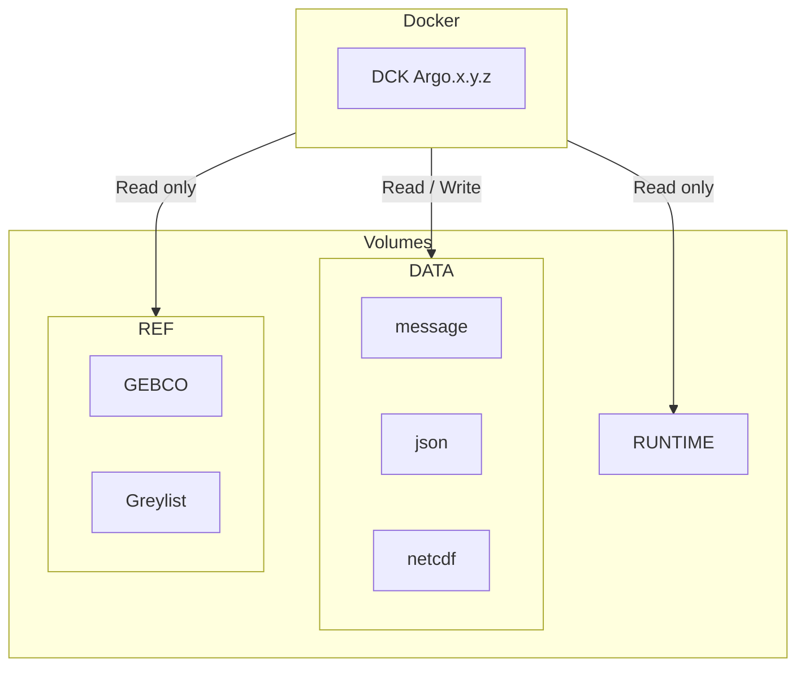

# Coriolis-data-processing-chain-for-Argo-floats-container

Coriolis data processing chain for Argo floats Containerized

## Architecture diagram



**Flux** :

<https://data-argo.ifremer.fr/ar_greylist.txt>

**Volumes** :

- `/mnt/runtime` : Matlab runtime environment
- `/mnt/data/output` : Output files directory
- `/mnt/data/rsync` : Input files directory
- `/mnt/data/config` :  external configurations directory
- `/mnt/ref/gebco.nc` : GEBCO file

## Run image in your environment

- Define next variables to configure the decoder on your environment

```bash
DECODER_IMAGE=<decoder image path>
DECODER_IMAGE_TAG=<decoder image tag>

DECODER_RUNTIME_DIR=<path to runtime directory>
DECODER_DATA_INPUT=<path to input directory>
DECODER_DATA_CONF=<path to conf directory>
DECODER_DATA_OUTPUT=<path to output directory>
DECODER_REF_GEBCO=<path to gebco file> # Optionnal
DECODER_REF_GREYLIST=<path to gebco file> # Optionnal

USER_ID=<uid volumes owner>
GROUP_ID=<gid volumes owner>
```

- Run the following script as an example to decode a single float.

```bash
FLOAT_WMO=6902892

rm -rf $DATA_OUTPUT/iridium/*$FLOAT_WMO 
rm -rf $DATA_OUTPUT/nc/$FLOAT_WMO

docker run -it --rm \
--name "argo-decoder-container" \
--user $USER_ID:$GROUP_ID \
--group-add gbatch \
-v $DECODER_RUNTIME_DIR:/mnt/runtime:ro \
-v $DECODER_DATA_INPUT:/mnt/data/rsync:rw \
-v $DECODER_DATA_CONF:/mnt/data/config:ro \
-v $DECODER_DATA_OUTPUT:/mnt/data/output:rw \
$DECODER_IMAGE:$DECODER_IMAGE_TAG /mnt/runtime 'rsynclog' 'all' 'configfile' '/app/config/_argo_decoder_conf_ir_sbd.json' 'configfile' '/app/config/_argo_decoder_conf_ir_sbd_rem.json' 'xmlreport' 'co041404_'$(date +"%Y%m%dT%H%M%SZ")'_'$FLOAT_WMO'.xml' 'floatwmo' ''$FLOAT_WMO'' 'PROCESS_REMAINING_BUFFERS' '1'
```

## Development

### Build image locally

- Use the following command to build the Docker image.

```bash
HEADER_TOKEN="DEPLOY-TOKEN: REPLACE_BY_DEPLOY_TOKEN"
APP_VERSION=20240111
APP_FILENAME=argo-decoder-${APP_VERSION}.zip
docker build -t decode-argo:develop --build-arg "HEADER_TOKEN=${HEADER_TOKEN}" --build-arg "APP_VERSION=${APP_VERSION}" --build-arg "APP_FILENAME=${APP_FILENAME}" .
```

- Run see run section to run the image.

## Argo workshop

This demonstration will run the Coriolis-data-processing-chain-for-Argo-floats based on a Dockerised Matlab Runtime on two Argo floats :

  - Arvor 6903014 : <https://fleetmonitoring.euro-argo.eu/float/6903014>
  - Arvor Deep 6903014 : <https://fleetmonitoring.euro-argo.eu/float/6902892>

### Prepare your environment

1. Lunix operating system **Required**
2. Folowing procedure to [Install Docker Engine](https://docs.docker.com/engine/install/#supported-platforms) according to your operating system, or use next example using generic script (not recommended for production environments)

      ```bash
      # Install docker with generic script 
      curl -fsSL https://get.docker.com/ | sudo sh

      # add your user to docker group
      sudo usermod -aG docker $USER

      # Check that the Docker Engine installation is successful by running the hello-world image
      sudo docker run hello-world
      ```

3. Install Git (*Optionnal*)

      ```bash
      sudo apt update
      sudo apt install git
      ```

### Run demo with docker compose

1. Get demo project

   - Option 1 : Using Git

   ```bash
   cd path-to-working-directory
   git clone -b feature/workshop https://github.com/euroargodev/Coriolis-data-processing-chain-for-Argo-floats.git
   cd Coriolis-data-processing-chain-for-Argo-floats
   ```

   - Option 2 : Manual download

   ```bash
   cd path-to-working-directory
   wget https://github.com/euroargodev/Coriolis-data-processing-chain-for-Argo-floats/archive/refs/heads/feature/workshop.zip
   unzip workshop.zip -d ./Coriolis-data-processing-chain-for-Argo-floats
   cd Coriolis-data-processing-chain-for-Argo-floats
   ```

2. Edit environement variables `.env` file with your favorite text editor to setup your configuration

      ```bash
      # or at least these commands tu setup your user
      sed -i "s/REPLACE_BY_USER_ID/$UID/g" .env
      sed -i "s/REPLACE_BY_GROUP_ID/$(id -g $UID)/g" .env
      ```

3. Run the demo decoder with docker compose

      ```bash
      docker compose up
      ```

4. Check next directory to consulte decoder outputs : `./decArgo_demo/output`
