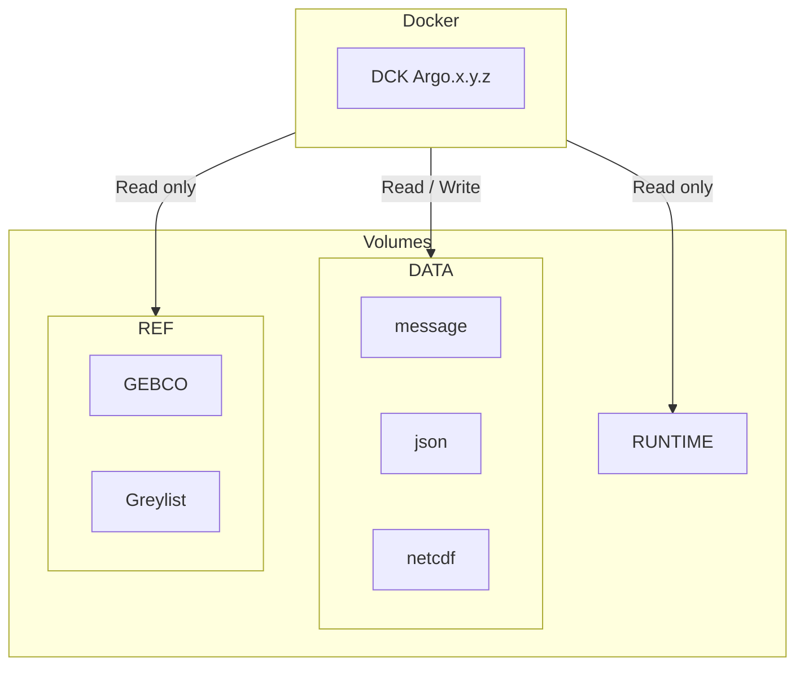

# Argo decoder Docker

## Architecture diagram



**Flux** :

<https://data-argo.ifremer.fr/ar_greylist.txt>

**Volumes** :

- `/mnt/runtime` : Matlab runtime environment
- `/mnt/data/output` : Output files directory
- `/mnt/data/rsync` : Rsync file directory
- `/mnt/data/config` :  external configurations directory
- `/mnt/ref/gebco.nc` : GEBCO file

## Run image with docker compose

1. Clone repository

      ```bash
      git clone https://github.com/euroargodev/Coriolis-data-processing-chain-for-Argo-floats.git
      ```

2. Create environment variables file from `.env.docs` to configure your environment

      ```bash
      cp .env.docs .env
      ```

3. Configure your environement by editing `.env`

4. Run your decoder with docker compose


## Run image with docker

```bash
APP_USER="<your_user_id>:<your_group_id>"
APP_VERSION=REPLACE_BY_APP_VERSION
RUNTIME=/path-to-runtime
DATA_OUTPUT=/path-to-data-output
DATA_RSYNC=/path-to-rsync
DATA_CONF=/path-to-configurations
REF_GEBCO=/path-to-gebco/GEBCO_2021.nc
```

- Run the following script to decode the float `6904101`.

```bash
rm -rf $DATA_OUTPUT/iridium/*6904101 
rm -rf $DATA_OUTPUT/nc/6904101

echo REPLACE_BY_DEPLOY_TOKEN | docker login gitlab-registry.ifremer.fr --password-stdin -u argo-decoder-registry-ro
docker run -it --rm \
--name "argo-decoder-container" \
--user $APP_USER \
--group-add gbatch \
-v $RUNTIME:/mnt/runtime:ro \
-v $DATA_OUTPUT:/mnt/data/output:rw \
-v $DATA_RSYNC:/mnt/data/rsync:rw \
-v $DATA_CONF:/mnt/data/config:ro \
-v $REF_GEBCO:/mnt/ref/gebco.nc:ro \
gitlab-registry.ifremer.fr/coriolis/developpement/argo/decodage/decode_argo:$APP_VERSION /mnt/runtime 'rsynclog' 'all' 'configfile' '/app/config/_argo_decoder_conf_ir_sbd.json' 'configfile' '/app/config/_argo_decoder_conf_ir_sbd_rem.json' 'xmlreport' 'co041404_20240124T112515Z_458271.xml' 'floatwmo' '6904101' 'PROCESS_REMAINING_BUFFERS' '1'
docker logout gitlab-registry.ifremer.fr
```

## Development

### Build and run image locally

- Run the following command to build the Docker image.

```bash
HEADER_TOKEN="DEPLOY-TOKEN: REPLACE_BY_DEPLOY_TOKEN"
APP_VERSION=20240111
APP_FILENAME=argo-decoder-${APP_VERSION}.zip
docker build -t decode-argo:develop --build-arg "HEADER_TOKEN=${HEADER_TOKEN}" --build-arg "APP_VERSION=${APP_VERSION}" --build-arg "APP_FILENAME=${APP_FILENAME}" .
```

- Run the following script to decode the float `6902810`.

```bash
APP_USER="<your_user_id>:<your_group_id>"
RUNTIME=/path-to-runtime
DATA_OUTPUT=/path-to-data-output
DATA_RSYNC=/path-to-rsync
DATA_CONF=/path-to-configurations
REF_GEBCO=/path-to-gebco/GEBCO_2021.nc

rm -rf $DATA_OUTPUT/iridium/*6902810 
rm -rf $DATA_OUTPUT/nc/6902810

docker run -it --rm \
--name "argo-decoder-container" \
--user $APP_USER \
--group-add gbatch \
-v $RUNTIME:/mnt/runtime:ro \
-v $DATA_OUTPUT:/mnt/data/output:rw \
-v $DATA_RSYNC:/mnt/data/rsync:rw \
-v $DATA_CONF:/mnt/data/config:ro \
-v $REF_GEBCO:/mnt/ref/gebco.nc \
decode_argo:develop /mnt/runtime 'rsynclog' 'all' 'configfile' '/app/config/_argo_decoder_conf_ir_sbd.json' 'configfile' '/app/config/_argo_decoder_conf_ir_sbd_rem.json' 'xmlreport' 'co041404_20240124T112515Z_458271.xml' 'floatwmo' '6904101' 'PROCESS_REMAINING_BUFFERS' '1'
```
